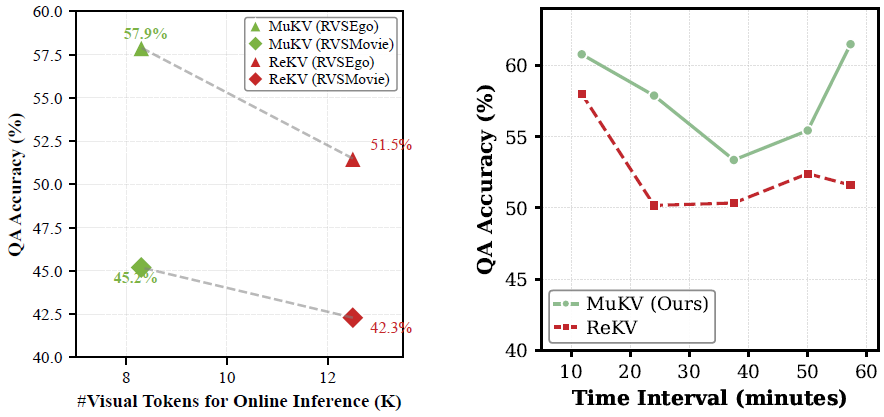

# MuKV: Multi-Grained KV Cache Compression for Long Streaming Video Question-Answering

[](https://opensource.org/licenses/Apache-2.0)
[](https://www.python.org/downloads/)
[](https://arxiv.org/abs/2605.22269)

Official PyTorch implementation of **"MuKV: Multi-Grained KV Cache Compression for Long Streaming Video Question-Answering"** [CVPR'26].

---

## 💡 Overview
Efficiently and accurately responsing to user questions over long, live video streams (either third-person view or first-person view) remains challenging, especially when the questions involve fine-grained details in the far past. Existing sparse sampling and sliding window approaches often trade-off visual details for efficiency. Video KV-cache memory provides a good alternative, but per-frame caching not only neglects information granularity but also brings heavy redanducy. We thus propose MuKV, a multi-grained KV-cache compression approach designed to improve streaming VideoQA. We highlight the followings:

- **Multi-Grained Context:** Represent past videos in hierarchically compressed KV tokens at segment, frame, and patch levels.
- **Redundancy Minimization:** Adaptively trim irrelevant tokens utilizing token attention importance and frequency signal. 
- **Efficiency and Accuracy:** Significantly improved QA accuracy, without sacrificing offline memory and online QA efficiency. The strength gets boosted as video length increases.


<p align="center">
  
  <br>
  <em>Figure 1: A comparison with ReKV under different online inference token count and video lengths.</em>
</p>


---

## 🚀 Getting Started

### 1. Environment Setup

We provide a convenient bash script to setup the exact dependencies and isolated conda environment automatically.

```bash
# It will create a conda env named 'mukv', install torch, flash-attn, transformers, etc.
bash prepare.sh
```

Activate the environment before proceeding:
```bash
conda activate mukv
```

### 2. Model Preparation

The core scripts are adapted to run across several Large Vision/Language models (e.g. `LLaVA-OneVision`). 

We support the official LLaVA-OneVision weights on Hugging Face:
- **0.5B Model**: [https://huggingface.co/llava-hf/llava-onevision-qwen2-0.5b-ov-hf](https://huggingface.co/llava-hf/llava-onevision-qwen2-0.5b-ov-hf)

By default, the code points to the 0.5B instance. The `transformers` library will download the weights automatically when you first run the server. You may also specify any other pre-downloaded local path using the `--model_path` argument.

### 3. Data Preparation

We conduct experiments primarily on **RVS-Ego** and **RVS-Movie** (MovieNet). 

1. **RVS-Ego & RVS-Movie**: We follow the original Real-Time VideoQA benchmarks. Annotations and instructions can be obtained from the [RVS Dataset Hugging Face](https://huggingface.co/datasets/Becomebright/RVS) repository.

Structure the annotations (`.json`/`.csv`) and video tensors (`.npy`/`.mp4`) inside the `data/` directory exactly as shown below:

```text
MuKV/
├── scripts/                # Execution Logic
├── model/                  # MuKV Implementation
├── assets/                 # Readme Images
├── data/
│   ├── rvs/
│   │   ├── ego/
│   │   │   ├── ego4d_oe.json
│   │   │   └── videos_npy_2fps/ (or videos/)
│   │   └── movie/
│   │       ├── movienet_oe.json
│   │       └── videos_npy/ (or videos/)
```

---

## ⚡ Inference & Evaluation

We abstract the entry points into simple `run_mukv_<dataset>.py` handlers inside the **`scripts/`** folder. You must execute all python commands directly from the root `MuKV/` directory.

### Evaluate on RVS-Ego (Open-Ended)

```bash
python scripts/run_mukv_rvs_ego.py \
    --model_path "llava-hf/llava-onevision-qwen2-0.5b-ov-hf" \
    --anno_path "data/rvs/ego/ego4d_oe.json" \
    --video_format "mp4" \
    --enable_compression true \
    --enable_rerank true
```

### Evaluate on RVS-Movie (Open-Ended)

```bash
python scripts/run_mukv_rvs_movie.py \
    --model_path "llava-hf/llava-onevision-qwen2-0.5b-ov-hf" \
    --anno_path "data/rvs/movie/movienet_oe.json" \
    --enable_compression true
```

*Logs, resulting prediction CSVs, and inference time memory stat snapshots will automatically be collected under the generated `results/mukv/` log directory.*

### Running via Shell Scripts

If you want to run exactly configured end-to-end evaluations without manually copying command-line arguments, you can directly execute the ready-made shell scripts inside `scripts/sh/`:
```bash
bash scripts/sh/run_mukv_rvs_ego.sh
```

### Cite
```
@article{xiao2026mukv,
  title={MuKV: Multi-Grained KV Cache Compression for Long Streaming Video Question-Answering},
  author={Xiao, Junbin and Chen, Jiajun and Sun, Tianxiang and Yang, Xun and Yao, Angela},
  booktitle={IEEE/CVF Conference on Computer Vision and Pattern Recognition (CVPR)},
  year={2026}
}
```
---

## 🙏 Acknowledgements

Our methodology expands upon the impressive foundation set by [LLaVA-OneVision](https://github.com/LLaVA-VL/LLaVA-NeXT). We thank the authors for their open-source contributions.

